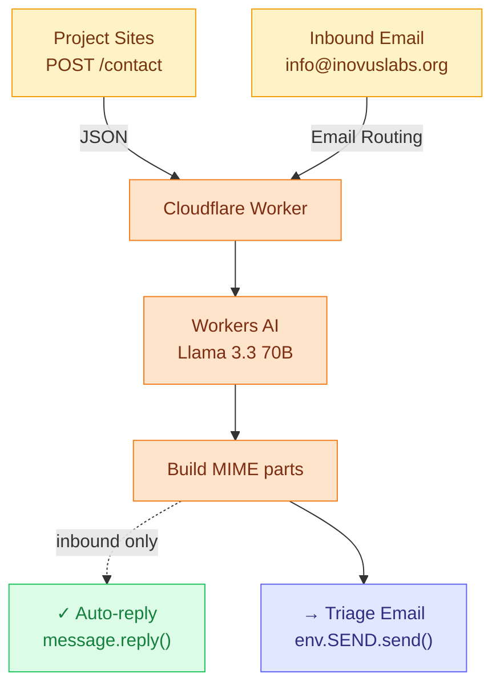

# Inovus Email Worker

A Cloudflare Worker that handles contact-form submissions and inbound email for Inovus Labs.

For every incoming message — whether it arrives via `POST /contact` or as a real email — Workers AI **drafts a contextual reply** specific to the message. On the inbound-email path that draft is sent back to the sender automatically; on the contact-form path the draft is included in the team triage email so a human can send it.

No DB, no tickets, no Durable Objects. Stateless.

## Architecture



The contact-form path skips `message.reply()` because there's no inbound `EmailMessage` to reply to, and `env.SEND.send()` rejects unverified destinations — see [Limitations](#limitations).

## Workers AI

`src/process.ts` calls `@cf/meta/llama-3.3-70b-instruct-fp8-fast` with a JSON-schema `response_format`:

```json
{ "reply": "<3–5 short sentences, plain text>" }
```

The system prompt forbids inventing facts/links/timelines and tells the model not to sign off (the template handles that). On failure: a generic `"Thanks for reaching out — we've received your message…"` fallback is used so an auto-reply still goes out.

## Cloudflare setup (one-time)

1. Add `inovuslabs.org` to Cloudflare DNS.
2. **Email → Email Routing → Enable** on `inovuslabs.org` (Cloudflare adds MX + SPF + DKIM).
3. **Destination addresses → Add** `inovuslabs@kjcmt.ac.in` and click the verification link. This is what unlocks `env.SEND.send()`.
4. **Routing rules → `info@inovuslabs.org` → Send to Worker → `support-email-worker`**.
5. Turnstile secret:

   ```sh
   bunx wrangler secret put TURNSTILE_SECRET
   ```

6. Deploy:

   ```sh
   bun run deploy
   ```

### Environment variables

| Var | Purpose |
| --- | --- |
| `MAIL_FROM` | From address for outbound mail (must be on a domain with Email Routing enabled). |
| `TEAM_INBOX` | Destination for the triage email. Must be a verified Email Routing destination. |
| `TURNSTILE_ENABLED` | `"true"` to require a Turnstile token on `/contact`. |
| `TURNSTILE_SECRET` | Set via `bunx wrangler secret put`. |

## Local development

```sh
bun install
bun run cf-typegen
bun run typecheck
bun run dev
```

Contact endpoint:

```sh
curl -X POST http://127.0.0.1:8787/contact \
  -H 'content-type: application/json' \
  -d '{
    "projectSlug": "spectrum",
    "name": "Jane Doe",
    "fromEmail": "jane@example.com",
    "subject": "Question about Spectrum",
    "message": "Hi, how do I run the demo locally?"
  }'
```

For Turnstile in local dev, set `TURNSTILE_SECRET` to Cloudflare's always-pass test key `1x0000000000000000000000000000000AA`.

Inbound email simulation:

```sh
bunx wrangler email send \
  --from someone@example.com \
  --to info@inovuslabs.org \
  --subject "Test" \
  --body "Hello, this is a test."
```

## Contact form contract

```http
POST https://support-email-worker.<subdomain>.workers.dev/contact
Content-Type: application/json

{
  "projectSlug": "spectrum",
  "name": "Jane Doe",
  "fromEmail": "jane@example.com",
  "subject": "Question about Spectrum",
  "message": "...",
  "turnstileToken": "<token from cf-turnstile widget, if TURNSTILE_ENABLED>"
}
```

Response:

```json
{ "ok": true, "intent": "support_question" }
```

`projectSlug` is `^[a-z0-9](?:[a-z0-9-]{0,30}[a-z0-9])?$`.

## File layout

```
src/
  index.ts             fetch + email entry points
  routes.ts            Hono app: POST /contact, GET /health
  process.ts           classify + build reply/triage MIMEs
  classify.ts          Workers AI call (json_schema response)
  utils.ts             turnstile, intent meta, html-strip
  types.ts             Env, Intent, Classification
  templates/
    shell.ts           shared HTML shell + escapeHtml
    auto-reply.ts      buildAutoReply (text + HTML)
    triage.ts          buildTriageEmail (text + HTML)
wrangler.jsonc         bindings: AI, SEND
```

## Limitations

- **No auto-reply to contact-form submitters.** `env.SEND.send()` only delivers to verified destinations, so contact-form submitters can't be auto-replied to without a third-party transactional sender (Resend, MailChannels, Postmark). Inbound email replies via `message.reply()` are unaffected.

## Deferred

- Transactional sender for contact-form auto-replies.
- Per-project FAQ / RAG before reply.
- Slack / Discord notifications on certain intents.
