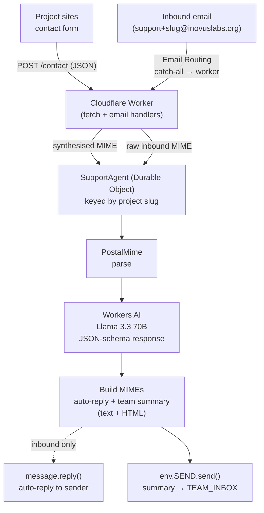

# Inovus Email Worker

A single Cloudflare Worker that handles contact-form submissions and inbound email for Inovus Labs:

- `POST /contact` — project sites post form submissions; each one is classified by Workers AI and a triage summary lands in the team inbox.
- Inbound email — anything routed to the worker via Cloudflare Email Routing is parsed, classified, auto-replied to, and summarised for the team.

No ticket store, no DB. Project slugs are used as Durable Object keys so per-project state (errors, future RAG indices) stays sticky.

## Architecture



The contact-form path skips `message.reply()` because there is no inbound `EmailMessage` to reply to, and `env.SEND.send()` rejects unverified destinations — see [Limitations](#limitations).

## Workers AI

`src/classify.ts` calls `@cf/meta/llama-3.3-70b-instruct-fp8-fast` with a JSON-schema `response_format` so the output is constrained to:

```json
{
  "intent": "support_question | collaboration | recruiting | media | spam | other",
  "confidence": 0.0,
  "summary": "single sentence, ≤160 chars"
}
```

Failure is non-fatal: a fallback classification (`other`, confidence 0, subject-as-summary) is returned and the email is still sent.

## Cloudflare setup (one-time)

1. Add `inovuslabs.org` to Cloudflare DNS.
2. **Email → Email Routing → Enable** on `inovuslabs.org`. Cloudflare adds MX + SPF records and configures DKIM.
3. **Destination addresses → Add** `inovuslabs@kjcmt.ac.in`, click the verification link Cloudflare emails. This unlocks `env.SEND.send()` for that address.
4. **Routing rules → Catch-all → Send to Worker → `support-email-worker`**. This makes `support+<anything>@inovuslabs.org` invoke the worker's `email()` handler.
5. Create a Turnstile site for your project form domains and store the secret:

   ```sh
   wrangler secret put TURNSTILE_SECRET
   ```

6. Deploy:

   ```sh
   npm run deploy
   ```

### Environment variables

| Var | Purpose |
| --- | --- |
| `MAIL_FROM` | From address used on outbound mail (must be on a domain with Email Routing enabled). |
| `TEAM_INBOX` | Destination for the AI-classified team summary. Must be a verified Email Routing destination. |
| `TURNSTILE_ENABLED` | `"true"` to require a Turnstile token on `/contact`. |
| `TURNSTILE_SECRET` | Secret (set via `wrangler secret put`). |

## Local development

```sh
npm install
npm run cf-typegen
npm run typecheck
npm run dev
```

Contact endpoint:

```sh
curl -X POST http://127.0.0.1:8787/contact \
  -H 'content-type: application/json' \
  -d '{
    "projectSlug": "spectrum",
    "name": "Jane Doe",
    "fromEmail": "jane@example.com",
    "subject": "Question about Spectrum",
    "message": "Hi, how do I run the demo locally?"
  }'
```

For Turnstile in local dev, set `TURNSTILE_SECRET` to Cloudflare's always-pass test key `1x0000000000000000000000000000000AA`.

Inbound email simulation:

```sh
wrangler email send \
  --from someone@example.com \
  --to support+spectrum@inovuslabs.org \
  --subject "Test" \
  --body "Hello, this is a test."
```

## Contact form contract

```http
POST https://support-email-worker.<subdomain>.workers.dev/contact
Content-Type: application/json

{
  "projectSlug": "spectrum",
  "name": "Jane Doe",
  "fromEmail": "jane@example.com",
  "subject": "Question about Spectrum",
  "message": "...",
  "turnstileToken": "<token from cf-turnstile widget, if TURNSTILE_ENABLED>"
}
```

Response:

```json
{ "ok": true, "intent": "support_question" }
```

`projectSlug` is `^[a-z0-9](?:[a-z0-9-]{0,30}[a-z0-9])?$` — lowercase letters, digits, hyphens; 1–32 chars.

## File layout

| File | Purpose |
| --- | --- |
| `src/index.ts` | `fetch` + `email` entry points |
| `src/contact.ts` | `POST /contact` handler (Zod validation, Turnstile, agent dispatch) |
| `src/agent.ts` | `SupportAgent` Durable Object: parse → classify → build reply + summary |
| `src/classify.ts` | Workers AI call with JSON-schema response format |
| `src/templates.ts` | MIME builders (auto-reply, team summary, contact form) — multipart text + HTML |
| `src/routing.ts` | `parseSubAddress` for `support+slug@domain` |
| `src/types.ts` | `Env`, `Intent`, `Classification` |
| `wrangler.jsonc` | Bindings: `AI`, `SEND`, `SupportAgent` (DO) |

## Limitations

- **No auto-reply to contact-form submitters.** `env.SEND.send()` only delivers to addresses verified in Email Routing, so we cannot reply to arbitrary form submitters from the `/contact` path. Inbound email replies (via `message.reply()`) are unaffected. To enable contact-form auto-replies, plug in a transactional email service (Resend, MailChannels, Postmark, etc.) called from `handleContact`.
- **No persistence.** Tickets, threads, and history are not stored. Each request is independent.

## Deferred

- Transactional sender for contact-form auto-replies.
- Per-project RAG / FAQ lookup before the reply step.
- Slack / Discord notifications on certain intents.
- Rate limiting beyond Turnstile.
